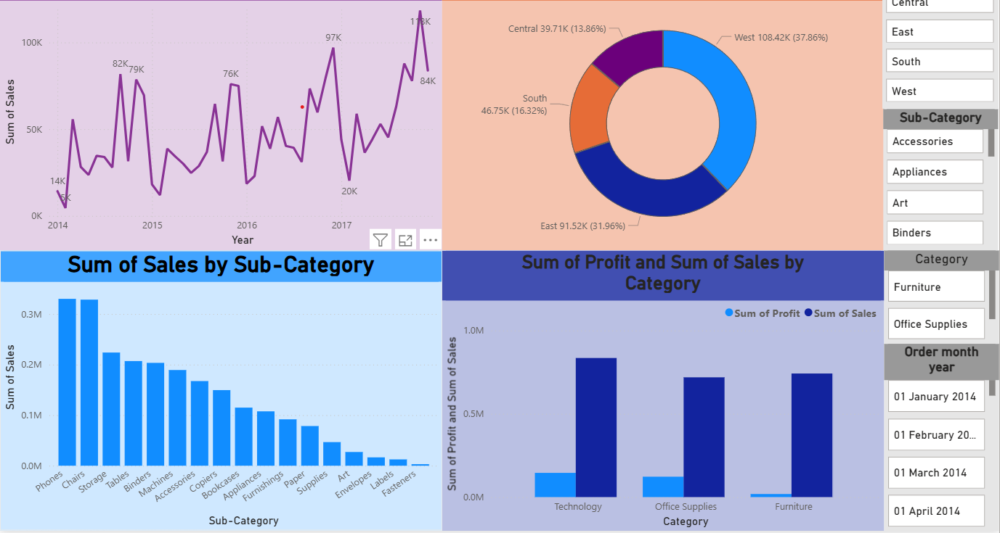

# Retail-Sales-Analysis
Retail Sales Analysis performed using Excel pivot tables and power bi dashboards. 

## 📌 Project Overview  
This project analyzes the **Superstore Dataset (Kaggle)** using **Excel for Data Cleaning** and **Power BI for Visualization & Dashboarding**.  

The goal was to extract insights on sales & profit trends, top-performing products, and regional performance.  

---

## 🛠 Tools & Skills Used  
- **Excel** → Data Cleaning (removing duplicates, handling missing values, formatting dates, preparing dataset)  
- **Power BI** → Interactive dashboard with slicers, charts, and insights  
- **Dataset** → [Sample Superstore Dataset (Kaggle)](https://www.kaggle.com/)  

---

## 📊 Dashboard Features  
- **Sales Trend** → Month-Year wise sales performance (Line Chart)  
- **Top Products** → Highest sales by Sub-Category (Bar Chart)  
- **Profit by Region** → Regional profit distribution (Column Chart)  
- **Category Performance** → Sales vs Profit by Category (Clustered Column Chart)  
- **Interactive Slicers** → Region, Category, Sub-Category, and Date  

---

## 📊 Dashboard Preview  

---

## 🙌 Acknowledgement  
Dataset: **Sample Superstore Dataset – Kaggle**  
